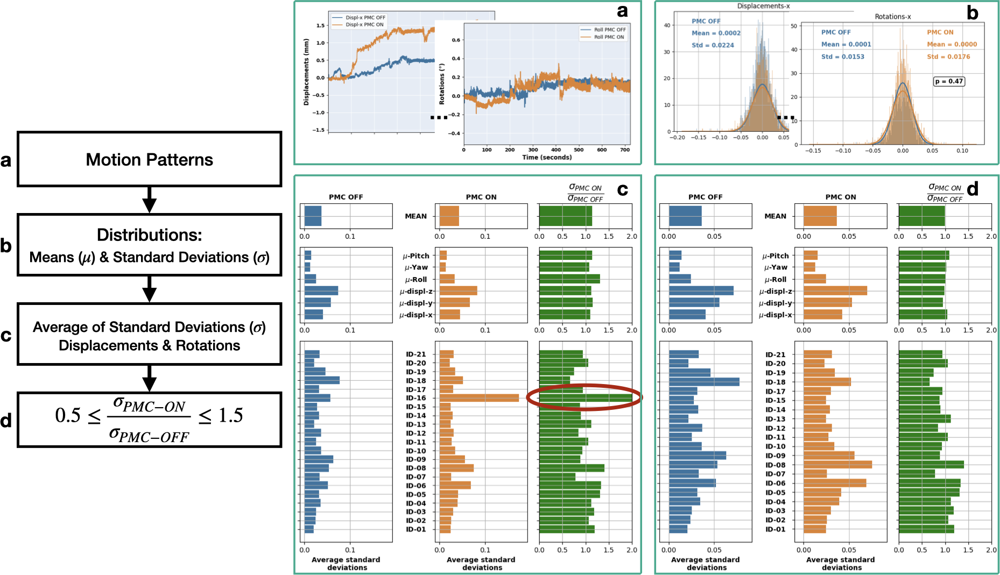

---


---


---


---


---


---


---


---


---


---


---

## Magnetic Resonance Imaging: 
### How does it work?

1. **Proton spins** initially exhibit random orientations in space. 
2. A **strong magnetic field** induces **alignment** of the proton spins.
3. **Radiofrequency pulses** induce **precession** in a subset of proton spins.
4. Following the pulse, these spins undergo **relaxation** back to their equilibrium orientations, resulting in the **emission** of detectable **signals**.
5. The emitted signals are **acquired** and **processed** to generate a diagnostic image.


---
```
   +---------------------+    1. Magnetic Fields
   |                     |    MRI Machine: Represents the MRI scanner. 
   |      MRI Machine    |    A superconductive magnet generates a strong static magnetic field.
   |                     |
   +---------------------+
            |
            |  Strong Magnetic Field
            |
            v
   +---------------------+    
   |                     |    Hydrogen Atoms: 
   |   Hydrogen Atoms    |     - The human body is primarily composed of water, which contains hydrogen atoms.
   |   Align with Field  |     - When placed in a strong magnetic field (typically 1.5T to 7T), 
   |                     |       the hydrogen protons align with the direction of the magnetic field.
   +---------------------+
            |
            |  RF Pulses
            |
            v
   +---------------------+     2. Radiofrequency Pulses
   |                     |     Excitation: Once the protons are aligned, the MRI machine sends radiofrequency (RF) pulses into the body. 
   |   Emit Signals      |     These pulses excite the protons, causing them to absorb energy and move to a higher energy state.
   |   as they Relax     |     Relaxation: After the RF pulse is turned off, the protons begin to relax back to their original state, 
   |                     |     releasing energy in the process.
   +---------------------+
            |
            |  Signals Processed
            |                  
            v                  3. Signal Detection
   +---------------------+     Receiving Coils: The released energy is detected by receiving coils in the MRI machine. 
   |                     |     The signals generated depend on the type of tissue and its environment, which allows 
   |   Image Formation   |     for differentiation between various structures in the body.
   |                     |
   +---------------------+     4. Image Reconstruction
                               Fourier Transform: The signals collected are processed using mathematical algorithms, 
                               primarily the Fourier Transform, to convert them into images. T
                               This process reconstructs the spatial information to create detailed cross-sectional images of the body.

```

---
 <!-- + Chemical Shift Artifacts:  While not purely motion-related, these artefacts can be exacerbated by patient movement and can manifest as misalignment between fat and water signals. -->

# K-Space and Motion Artefacts

- MRI data is acquired in a domain known as k-space, which is a matrix that represents the spatial frequency information of the image. 
- Each point in k-space corresponds to a specific frequency and phase of the MRI signal. 
- The process of filling k-space is crucial for reconstructing the final image.
---
# How Motion Corrupts K-Space 

1. Incomplete Data Acquisition
  - If a patient moves during the acquisition of k-space data, the signals collected may not correspond to the same anatomical location. This misalignment leads to inconsistencies in the data, resulting in artifacts in the final image. 

2. Phase Errors
  - Motion can introduce phase shifts in the acquired signals. Since k-space is sensitive to the phase of the signals, any discrepancies caused by motion can lead to blurring or ghosting effects in the reconstructed image. 

3. Aliasing 
  - If motion occurs while acquiring data from different parts of k-space, it can cause aliasing artifacts. This happens when the data from one part of the image is incorrectly mapped to another part due to the motion, leading to overlapping or repeating structures in the final image.

 4. Signal Loss 
  - Motion can also lead to signal loss in certain areas of the brain, particularly if the motion occurs during the acquisition of specific k-space lines. This can result in areas of the image appearing darker or missing entirely.

---
#### State-of-the-Art in Motion Correction

| Technique                         | Description                                                                               |
|-----------------------------------|-------------------------------------------------------------------------------------------|
| **Prospective Motion Correction (PMC)** | Real-time adjustments during MRI acquisition.                                            |
| **Retrospective Motion Correction (RMC)** | Post-processing techniques to correct motion artefacts.                                |
| **Data Acquisition Strategies**       | Techniques like PROPELLER, radial/spiral sampling, and fast-imaging methods.              |

#### Recent AI Advances
| AI Technique                      | Description                                                                               |
|-----------------------------------|-------------------------------------------------------------------------------------------|
| **Deep Learning Approaches**          | Neural networks for motion artefact reduction and motion estimation.                      |
| **Self-Supervised Learning**          | Uses motion-guided implicit neural representations for correction.                        |
| **Physics-Informed Models**           | Combines deep learning with physics-based modeling for improved accuracy.                 |

---

- **Real-Time Monitoring**: 
  + PMC systems utilize motion tracking devices to monitor head movements during the scan.
  + This allows for immediate detection of any changes in position and orientation.
- **Dynamic Adjustments**:
  + Once motion is detected, the imaging system adjusts the acquisition parameters in real-time.
  + This may involve altering the gradient fields or the timing of radio-frequency pulses to compensate for the detected motion.

- **Affine Transformations**:
  + The adjustments made are often based on affine transformations, which help align the images as they are being acquired.
  + This ensures that the images remain consistent and aligned with the intended anatomical structures.

- **Integration with Imaging Sequences**:
  + PMC can be integrated with various imaging sequences.
  + The effectiveness of PMC can vary depending on the specific sequence used and the nature of the motion. 
---

### Challenges and Considerations

- Precision and Accuracy:

The success of PMC relies heavily on the precision of motion measurement. If the motion is not accurately detected, the corrections may be inadequate.
Continuous validation of PMC methods is essential to ensure they are effective across different imaging scenarios.

- Impact of New Imaging Techniques:

As imaging technology evolves, such as with the introduction of multiplexed EPI, existing PMC techniques may need reevaluation.
New sequences may introduce different motion sensitivities that could affect the performance of PMC.

- Holistic Approach:

A comprehensive understanding of the entire fMRI process, from acquisition to analysis, is crucial for optimizing PMC.

Collaboration between pulse sequence developers and image processing algorithm designers can lead to better outcomes.

--- 

## Future Directions

- Improved Algorithms:

Ongoing research is focused on developing more sophisticated algorithms that can better handle motion correction in real-time.
This includes exploring machine learning techniques to enhance motion detection and correction capabilities.
Validation and Testing:

There is a need for rigorous testing of PMC methods across various fMRI applications to establish their reliability and effectiveness.
Researchers should demand a higher burden of proof before adopting new PMC techniques in clinical and research settings.
Prospective motion correction represents a significant advancement in fMRI technology, aiming to enhance the quality of brain imaging by addressing the challenges posed by patient movement 


---

## Image acquisition of a $T_2^*$-weighted 2D gradient image. (a) Pulse sequence diagram; (b) k-space 2D-image and (c) reconstructed 2D-image.


---
## Future Directions

- Enhancing generalization across different datasets.
- Reducing the need for extensive training data.
- Integrating AI with real-time MRI systems for better patient outcomes.

---
#### Assessing the impact of the prospective motion correction using  an in-bore optical tracking system, in case of high-resolution  structural imaging in regime of quasi-no motion. 
 - Prospective Motion Correction (PMC):
  + Tackle the problem of motion correction at 7T MRI in a regime of quasi-no-motion, 
  focusing solely on high resolution brain imaging.

- Deep Learning Based Retrospective Motion Correction (RMC):
  + Assess image quality through Structural Similarity Index (SSIM) predictions.
  + Implement motion correction using various ad-hoc models tailored to specific motion artifacts. 

---
### Sequence parameters

| **Sequence**        | MPRAGE         | TSE            | TSE            | GRE            | GRE            | GRE            |
|---------------------|----------------|----------------|----------------|----------------|----------------|----------------|
| **Encoding**        | 3D             | 2D             | 2D             | 2D             | 2D             | 2D             |
| **Contrast**        | $T_1$          | $T_2$          | $PD$           | $T_2^*$        | $T_2^*$        | $T_2^*$        |
| **PMC**             | On/Off         | On/Off         | On/Off         | On/Off         | On/Off         | On/Off         |
| **In-plane res. (mm)** | 0.45 iso | 0.28 iso | 0.28 iso | 0.5 iso | 0.35 iso | 0.25 iso |
| **Slice thick. (mm)** | 0.45          | 1.0            | 1.0            | 1.5            | 1.5            | 1.5            |
| **Matrix size (voxel)** | 496 x 496    | 690 x 704      | 690 x 704      | 336 x 448      | 480 x 640      | 672 x 896      |       
| **Voxel vol. (mm$^3$)** | 0.091        | 0.078          | 0.078          | 0.375          | 0.184          | 0.094          |
| **Slices**          | 416            | 15             | 15             | 30             | 30             | 30             |
| **TR (ms)**         | 2820           | 6000           | 6000           | 680            | 680            | 680            |
| **TE (ms)**         | 2.82           | 59.0           | 9.9            | 16.6           | 15.1           | 16.6           |
| **TI (ms)**         | 1050           | -              | -              | -              | -              | -              |
| **Flip angle (deg)**| 5              | 130            | 130            | 30             | 30             | 30             |
| **Bandwidth (Hz/px)** | 170          | 473            | 473            | 60             | 60             | 60             |
| **Total ADC (ms)**  | 5.88           | 2.11           | 2.11           | 16.67          | 16.67          | 16.67          |
| **TA (min:sec)**    | 12:12          | 5:12           | 5:12           | 8:21           | 11:37          | 15:58          |
| **Parallel imaging** | GRAPPA 2       | GRAPPA 2       | GRAPPA 2       | GRAPPA 2       | GRAPPA 2       | GRAPPA 2       | 


---



--- 
### Study: 
- a 7T whole-body MRI scanner (Siemens Healthineers, Erlangen, Germany)
- a 32-channel head coil (Nova Medical, Wilmington, MA, USA) 
- Optical Motion Tracking System (OMTS), Metria Innovation Inc., Milwaukee, WI, USA
- 21 healthy volunteers were scanned over the course of two independent 75-minute long sessions 
(14 males, 31.5±6.1 years old, and 7 females, 27.3±3.4 years old).
- $T_1$, $T_2$, $PD$ and $T_2^*$-weighted images for each subject were acquired 


---

 ### Extra:

- **Intentional Motion**:
  + PMC improves image quality even with high levels of motion.
  + Indicates potential use for non-compliant patients (e.g., Parkinson's disease) when combined with additional motion prevention or RMC techniques. -->

 ---

## Limitations
- **Statistical Significance**:
  + Limited scenarios showed statistically significant improvement.
  + Some cases exhibited inconsistencies between subjective and objective measures.

- **Motion Pattern Variability**:
  + Comparability of motion patterns for PMC ON and OFF not always consistent.
  + Some groups did not show clear superiority in image quality metrics.

- **Extremes of Motion**:
  + PMC's effectiveness decreases with very high levels of motion.
  + Requires further techniques or integration with RMC for extreme cases or non-compliant patients.

- **Patient Compliance**:
  + Effectiveness is more pronounced in compliant subjects.
  + Additional challenges in applying PMC to non-compliant patients without supplementary measures. 


--- 

 ## Introduction to AI in Medical Imaging

- **Artificial Intelligence (AI)**: The simulation of human intelligence processes by machines, especially computer systems.
- **Deep Learning**: A subset of AI that uses neural networks with many layers to analyze various factors of data.

### Role of AI in MRI

- **Data Analysis**: AI algorithms can process and analyze large volumes of MRI data quickly and accurately.
- **Pattern Recognition**: Deep learning models excel at identifying complex patterns in imaging data, including motion artefacts. 


---

### Deep Learning Approaches

- **Convolutional Neural Networks (CNNs)**: Commonly used for image processing tasks, including artifact detection.
- **Generative Adversarial Networks (GANs)**: Can be employed to generate high-quality images from corrupted data.
- **Reinforcement Learning**: Potential for optimizing motion correction strategies in real-time.


### Benefits of Using AI and Deep Learning

- **Improved Accuracy**: Enhanced detection and correction of motion artefacts lead to better image quality.
- **Efficiency**: Reduces the need for repeat scans, saving time and resources.
- **Automation**: Streamlines the workflow in clinical settings, allowing radiologists to focus on diagnosis.

---

- The evaluation metrics used for PMC@7T, specifically GE and AES, effectively demonstrate the benefits of the PMC system through comparisons of on vs. off conditions.
  
- However, in general MRI practice, there are no reference images available post-scan for quality assessment.

- Existing no-reference image quality assessment (IQA) metrics are not always compliant with all acquisition types, highlighting the need for more robust evaluation methods.

- To address this gap, it has been developed a novel approach utilizing **deep learning for SSIM prediction**, providing a more reliable assessment of image quality.

---
### Training Process
1. **Slice Selection**: Random 2D slice (axial, sagittal, or coronal orientation).
2. **Contrast Augmentation**: Randomly apply one of four algorithms:
   - Gamma adjustment, Logarithmic adjustment, Sigmoid adjustment, Adaptive histogram adjustment
3. **Motion Corruption**: Apply motion corruption using:
   - TorchIO or In-house algorithm
4. **SSIM Calculation**: Determine SSIM between input and corrupted images.
5. **Model Training**: Use corrupted image and SSIM for training. 

---
## Datasets Used
- **Training**: 200 volumes
- **Validation**: 50 volumes
- **Testing**: 50 volumes
- Sources: IXI dataset, Site-A (3T), Site-B (7T), various scanners.
- Resampling for isotropic resolution of 1.00 mm³.

## Training Parameters
- Training conducted with and without contrast enhancement.
- Learning rate: 1e−3
- Batch size: 100
- Loss function: Mean Squared Error (MSE)
- Optimizer: Adam
- Epochs: 2000
- Image size: 256x256

---

## Performance Assessment
- Predicted SSIM vs. ground truth SSIM (10,000 images randomly selected).
- Residuals calculated for model performance.
 - Prediction task converted to classification with 3, 5, and 10 classes.

## Clinical Dataset Testing
- Included images from five subjects with varying scans.
- Subjective quality assessment by an expert using a classification scheme:
  - Class 1: Good quality (SSIM 0.85-1.00)
  - Class 2: Sufficient quality (SSIM 0.60-0.85)
  - Class 3: Insufficient quality (SSIM 0.00-0.60) 

 ## Comparison with MRIQC
- MRIQC used as a baseline for comparison.
- Limitations: Only works on properly transformed BIDS format images.
- Metrics used: CNR, CJV, EFC, QI for structural images.
- SIQA scores averaged and normalized for agreement analysis. 

 ---

- **CNR**: Contrast-to-noise Ratio, $\text{CNR} = \frac{C}{N}$, where:
  + $C$ = Contrast between the object and background.
  + $N$ = Noise level in the image or signal.

- **CJV**: Coefficient of Joint Variation, $\text{CJV}=\frac{\sigma(WM)+\sigma(GM)}{\mu(WM)-\mu(GM)}$, where $\sigma$ and $\mu$ indicate the standard deviation and the mean intensity of a given tissue.

- **EFC**: Entropy Focus Criterion, $E =-\sum_{j=1}^{S}\frac{B_j}{B_{max}}ln\Big[\frac{B_j}{B_{max}}\Big]$, where $S$ is the number of image pixels and $B_j$ is the modulus of the complex value of the th image pixel, referred to here as the pixel “brightness”. If all the image energy were in one pixel, we would have the largest possible pixel brightness, $B_{max}$ , given by $B_{max}=\sqrt{\sum_{j=1}^{S}B_{j}^2}$

- **QI**: Quality Index, Mortamet B, Bernstein MA, Jack CR Jr, et al. Automatic quality assessment in structural brain magnetic resonance imaging. Magn Reson Med. 2009;62(2):365-372. doi:10.1002/mrm.21992
<!-- ## Image Quality Assessment Through SSIM Prediction -->
<!-- ### Importance of Image Quality
- Motion artefacts can lower diagnostic accuracy.
- May require repeat scans to avoid misdiagnosis. -->

<!-- ### Image Quality Assessment (IQA) -->
<!-- - **IQA**: Quick, automated process to evaluate MR images.
- Goal: Assess the image quality level 
- Challenges:
  - Time-consuming and subjective evaluation.
  - Varying expertise among readers leads to inconsistent outcomes.
  - Lack of reference images complicates assessment. -->

<!-- ---
###  Advances in IQA
- Reference-free IQA methods emerging, including machine learning approaches.
- No gold standard IQA for MR images yet.

### Proposed Solution
- Development of an automated IQA tool based on SSIM (Structural Similarity Index).
- Tool identifies motion artefacts and measures distortion.
- Applicable to various MR image contrasts (T1, T2, PD, FLAIR).
- Incorporates contrast augmentation for broader weighting range. -->

<!-- ---

### Methodology
- Two methods to artificially produce corrupted images:
  1. In-house developed method.
  2. Implementation by Shaw et al. using TorchIO library.

### ResNets Models (ready-to-use):
- Two depths used: ResNet-18 and ResNet-101. -->
<!-- ---
 -->
<!-- ## Figures Overview
- **Figure 39**: Example outputs of SSIM predictions.
- **Figure 40**: SSIM vs. ground truth with linear fitting.
- **Figure 41**: Residual distribution analysis.
- **Figure 42**: Confusion matrices for classification tasks.
- **Table 10**: Precision, recall, F1-score, and accuracy. -->
<!-- ---


### Model Performance
- **Best Performance**: 
ResNet-18 with contrast augmentation
  - Accuracy: 
    - 97% (3 classes)
    - 95% (5 classes)
    - 89% (10 classes)
- **Impact of Contrast Augmentation**:
  - Reduced standard deviation
  - Improved mean SSIM predictions -->

<!-- ---
 -->

<!-- ---
 -->

<!-- ### Clinical Data Evaluation
- **Agreement**: 76.6 ± 0.8%
  - ResNet-101: 
    - 75.5% (without contrast)
    - 77.7% (with contrast) -->
<!-- 
### MRIQC Comparison
- **Processed Scans**: 12 of 36 due to non-compliance
- **Agreement Rates**:
  - CNR: 17%
  - CJV: 17%
  - EFC: 33%
  - QI: 75% -->

<!-- ---

## Discussion
- Contrast augmentation improved performance. -->
<!-- - Accuracy decreased with more classes. -->
<!-- - Confusion matrices showed higher misclassification rates with more classes. -->
---
# Some important Equation ...
---

## Schrödinger Equation

$
i\hbar \frac{\partial}{\partial t} \Psi(\mathbf{r}, t) = \hat{H} \Psi(\mathbf{r}, t)
$

- **Explanation**: 
  - The Schrödinger equation describes how the quantum state of a physical system changes over time.
  - $\Psi$ is the wave function, $\hat{H}$ is the Hamiltonian operator, and $\hbar$ is the reduced Planck's constant.

- **Importance in MRI**: 
  - It provides the foundation for understanding the quantum behavior of nuclear spins in a magnetic field, which is essential for MRI signal generation.

---
##  Larmor Frequency

$
f = \frac{\gamma B_0}{2\pi}
$

- **Explanation**: 
  - The Larmor frequency $f$ is the frequency at which the magnetic moments of nuclei precess in a magnetic field $B_0$.
  - $\gamma$ is the gyromagnetic ratio, which is specific to each type of nucleus (e.g., hydrogen).
  - This frequency is crucial for determining the resonance condition in MRI.
--- 

## Bloch Equations

$\frac{dM_x}{dt} = \gamma M_y B_0 - \frac{M_x}{T_2}$
$\frac{dM_y}{dt} = -\gamma M_x B_0 - \frac{M_y}{T_2}$
$\frac{dM_z}{dt} = -\frac{M_z - M_0}{T_1}$

- **Explanation**: 
  - The Bloch equations describe the dynamics of magnetization $ \mathbf{M} $ in a magnetic field, accounting for relaxation processes ($T_1$ and $T_2$).
  
- **Importance in MRI**: 
  - They are crucial for understanding how spins return to equilibrium after excitation, which directly affects image contrast and quality.

---

## 4. Signal Equation

$
S(t) = \int M(t) e^{-i \omega t} dt$

- **Explanation**: 
  - This equation represents the signal $S(t)$ detected in MRI as a function of time, where $M(t)$ is the magnetization vector and $\omega$ is the angular frequency.

- **Importance in MRI**: 
  - It illustrates how the time-varying magnetization generates the MRI signal, which is essential for image reconstruction.

---
## Relaxation Times

### $T_1$ Relaxation

$
M(t) = M_0 \left(1 - e^{-\frac{t}{T_1}}\right)
$

- **Explanation**: 
  - T1 is the longitudinal relaxation time, representing the time it takes for the magnetization to recover to its equilibrium state.
  - $M_0$ is the equilibrium magnetization, and $M(t)$ is the magnetization at time $t$.

### $T_2$ Relaxation

$
M(t) = M_0 e^{-\frac{t}{T_2}}
$

- **Explanation**: 
  - $T_2$ is the transverse relaxation time, indicating the time it takes for the transverse magnetization to decay.
  - This decay is due to interactions between spins, leading to loss of coherence.

---

## Signal Equation

$
S = \frac{M_0 \cdot \gamma^2 \cdot B_0^2 \cdot T_1}{T_2}
$

- **Explanation**: 
  - The signal $S$ received in MRI is proportional to the equilibrium magnetization $M_0$, the square of the gyromagnetic ratio $\gamma$, the square of the magnetic field $B_0$, and the ratio of $T_1$ to $T_2$.
  - This equation highlights the dependence of the MRI signal on tissue properties.

---

## Fourier Transform

$f(t) = \int_{-\infty}^{\infty} S(\omega) e^{i \omega t} d\omega$

- **Explanation**: 
  - The Fourier Transform is used to convert the time-domain signal $S(t)$ into the frequency domain.
  - This transformation is essential for image reconstruction in MRI, allowing the spatial information to be extracted from the frequency data.


$f(x, y) = \int_{-\infty}^{\infty} S(k_x, k_y) e^{i(k_x x + k_y y)} dk_x dk_y$

- **Explanation**: 
  - The Fourier Transform converts the k-space data $S(k_x, k_y)$ into the spatial domain $f(x, y)$.

- **Importance in MRI**: 
  - This transformation is fundamental for reconstructing images from the acquired k-space data, allowing clinicians to visualize the anatomy.

---

## Image Reconstruction

$
I(x, y) = \sum_{k=1}^{N} S_k \cdot e^{-i \phi_k}
$

- **Explanation**: 
  - The image $I(x, y)$ is reconstructed from the acquired signals $S_k$ and their corresponding phases $\phi_k$.
  - This equation represents the process of combining multiple signals to form a coherent image, taking into account the phase information.

---

The most important formula for prospective motion correction using 
an optical tracking system in MRI typically involves the transformation 
of the imaging coordinates based on the motion detected by the optical 
tracking system. One common approach is to use a transformation matrix 
that accounts for the motion parameters (translation and rotation) 
to adjust the imaging data in real-time.

---
### Transformation Formula

The general formula for transforming the coordinates can be expressed as:

$$\mathbf{p}' = \mathbf{R} \cdot \mathbf{p} + \mathbf{t}$$

- **Where**:
  - $\mathbf{p}$ is the original position vector of a point in the image space.
  - $\mathbf{p}'$ is the transformed position vector after accounting for motion.
  - $\mathbf{R}$ is the rotation matrix that represents the rotation of the object being imaged.
  - $\mathbf{t}$ is the translation vector that represents the movement of the object.

---

### Explanation

1. **Rotation Matrix ($\mathbf{R}$)**:
   - The rotation matrix is a 3x3 matrix that describes how the object has rotated in space. It is derived from the angles of rotation around the x, y, and z axes.

2. **Translation Vector ($\mathbf{t}$)**:
   - The translation vector accounts for any linear movement of the object in the x, y, and z directions.

3. **Application in MRI**:
   - By continuously tracking the motion of the patient or the object being imaged using an optical tracking system, the MRI system can apply these transformations in real-time to correct for motion artifacts, ensuring that the images obtained are accurate and representative of the intended anatomy.

This formula is fundamental in the implementation of prospective motion correction techniques 
in MRI, allowing for improved image quality and diagnostic accuracy.

---

### Prospective Motion Correction (PMC) in MRI

**Prospective Motion Correction (PMC)** is a technique used in MRI to minimize motion artifacts caused by patient movement during the scanning process. The goal of PMC is to adjust the imaging data in real-time based on motion detected by an external tracking system, such as an optical tracking system. 

---
#### How PMC Works

1. **Motion Tracking**:
   - An optical tracking system continuously monitors the position and orientation of the patient or the region of interest. This system typically uses markers placed on the patient or the imaging region to detect motion in real-time.

2. **Data Acquisition**:
   - As the MRI scanner acquires data, the tracking system provides information about any detected motion. This information includes both translational and rotational movements.


---
3. **Real-Time Correction**:
   - The acquired k-space data (the frequency domain representation of the image) is adjusted based on the motion parameters obtained from the tracking system. The transformation of the k-space data is done using the transformation formula mentioned earlier:
     $$
     \mathbf{p}' = \mathbf{R} \cdot \mathbf{p} + \mathbf{t}
     $$
   - This adjustment ensures that the data corresponds to the intended position of the anatomy at the time of acquisition.

4. **Image Reconstruction**:
   - After the k-space data has been corrected for motion, it is transformed back into image space using the inverse Fourier transform. The resulting images are less affected by motion artifacts, leading to improved image quality.


---

### Guaranteeing K-Space Consistency

To ensure k-space consistency during PMC, several strategies are employed:

1. **Continuous Monitoring**:
   - The optical tracking system continuously monitors motion, allowing for immediate adjustments to the k-space data as motion occurs. This real-time feedback loop helps maintain consistency.

2. **Dynamic Repositioning**:
   - The k-space data is dynamically repositioned based on the detected motion. This means that if a patient moves, the data collected during that time can be adjusted to reflect the new position, ensuring that the data remains consistent with the actual anatomy.

---

3. **Interpolation Techniques**:
   - When motion occurs, interpolation techniques may be used to estimate the k-space data that would have been acquired if the patient had not moved. This helps fill in gaps in the k-space data caused by motion.

4. **Sampling Strategy**:
   - The sampling strategy can be designed to minimize the effects of motion. For example, using a segmented approach where data is acquired in smaller segments can help in adjusting for motion between segments.

5. **Motion Prediction**:
   - Advanced algorithms may predict motion based on previous frames, allowing for preemptive adjustments to the k-space data before motion occurs.

By implementing these strategies, PMC can effectively maintain k-space consistency, leading to high-quality images that are less affected by motion artifacts. This is particularly important in clinical settings where patient movement is common, and accurate imaging is crucial for diagnosis and treatment planning.

---

# Maxwell's Equations and Their Relation to MRI

---

## 1. Gauss's Law for Electricity

$
\oint \mathbf{E} \cdot d\mathbf{A} = \frac{Q_{enc}}{\varepsilon_0}
$

- **Explanation**: 
  - The electric flux through a closed surface is proportional to the charge enclosed within that surface.
  
- **Relation to MRI**: 
  - Electric fields generated by RF coils are crucial for exciting nuclear spins in tissue.

- **Example**: 
  - An RF pulse creates an oscillating electric field that interacts with hydrogen nuclei, causing them to resonate and emit signals.

---

## 2. Gauss's Law for Magnetism

$
\oint \mathbf{B} \cdot d\mathbf{A} = 0
$

- **Explanation**: 
  - There are no magnetic monopoles; the total magnetic flux through a closed surface is zero.

- **Relation to MRI**: 
  - A strong, uniform magnetic field is generated by superconducting magnets, essential for imaging.

- **Example**: 
  - Uniformity of the magnetic field ensures consistent Larmor frequency across the imaging volume for accurate signal acquisition.

---

## 3. Faraday's Law of Induction

$\oint \mathbf{E} \cdot d\mathbf{l} = -\frac{d\Phi_B}{dt}$

- **Explanation**: 
  - A changing magnetic field induces an electromotive force (EMF) in a closed loop.

- **Relation to MRI**: 
  - Changing magnetic fields during RF pulses and spin relaxation generate signals detected by receiver coils.

- **Example**: 
  - Relaxing hydrogen nuclei generate a time-varying magnetic field that induces voltage in receiver coils, forming an image.

---

## 4. Ampère-Maxwell Law

$
\oint \mathbf{B} \cdot d\mathbf{l} = \mu_0 I_{enc} + \mu_0 \varepsilon_0 \frac{d\Phi_E}{dt}
$

- **Explanation**: 
  - Relates the magnetic field around a closed loop to the electric current and the rate of change of the electric field.

- **Relation to MRI**: 
  - RF coils generate magnetic fields when electric current flows, essential for creating RF pulses.

- **Example**: 
  - Energized RF coils create an oscillating magnetic field tuned to the Larmor frequency, allowing effective excitation and signal generation.

---

# Summary

Maxwell's equations provide the theoretical foundation for understanding the electromagnetic principles underlying MRI technology. Each equation plays a critical role in MRI operation, from generating magnetic fields to detecting emitted signals.


<!-- Motion artifacts in MRI are distortions or errors in the images caused by patient movement during the scanning process. These artifacts can significantly affect the quality of the images and may lead to misinterpretation of the results. Here are some key points regarding motion artifacts in MRI:

Causes of Motion Artifacts
Patient Movement: Any voluntary or involuntary movement by the patient, such as breathing, swallowing, or muscle contractions, can lead to motion artifacts.
Physiological Motion: Natural body processes, such as heartbeat and respiration, can cause shifts in the position of structures being imaged.
Long Scan Times: Longer MRI sequences increase the likelihood of patient movement, making it essential to minimize scan duration when possible.
Types of Motion Artifacts
Ghosting Artifacts:

Description: These appear as repetitive, faint copies of the main image, often aligned with the direction of movement.
Cause: Typically caused by periodic motion, such as breathing or pulsatile blood flow.
Blurring:

Description: This results in a loss of sharpness in the images, making structures appear smeared or fuzzy.
Cause: Can occur due to any movement during the acquisition of the image data.
Phase Encoding Artifacts:

Description: These artifacts occur when motion happens during the phase encoding step of the MRI sequence, leading to distortions in the final image.
Cause: Often linked to respiratory motion, resulting in spatial misregistration of tissue.
Chemical Shift Artifacts:

Description: While not purely motion-related, these artifacts can be exacerbated by patient movement and can manifest as misalignment between fat and water signals.
Cause: Differences in resonance frequencies between fat and water protons can cause misregistration, particularly at fat-water interfaces.
Mitigation Strategies
Patient Preparation:

Educate patients about the importance of remaining still during the scan.
Use comfort measures, such as pillows or straps, to help minimize movement.
Breath-Holding Techniques:

Instruct patients to hold their breath during specific sequences, especially for abdominal imaging, to reduce motion from respiration.
Shorter Scan Times:

Utilize faster imaging techniques, such as parallel imaging or compressed sensing, to reduce the time needed for acquisition.
Motion Correction Algorithms:

Implement advanced post-processing techniques that can help correct for motion artifacts in the acquired images.
Use of Sedation:

In cases of extreme anxiety or inability to remain still, sedation may be considered, especially in pediatric or claustrophobic patients.
Conclusion
Motion artifacts in MRI can significantly impact image quality and diagnostic accuracy. Understanding the causes and types of motion artifacts, as well as employing strategies to mitigate them, is essential for obtaining high-quality MRI images and ensuring accurate clinical interpretations. -->


<!-- 1. Magnetic Field
- **Alignment of Protons**:
  - The human body is primarily composed of water, which contains hydrogen atoms.
  - When placed in a strong magnetic field (typically 1.5T to 7T), the hydrogen protons align with the direction of the magnetic field.

2. Radiofrequency Pulses
- **Excitation**:
  - A radiofrequency (RF) pulse is applied, which temporarily disrupts the alignment of the protons.
  - The frequency of the RF pulse is tuned to the Larmor frequency, which is specific to the strength of the magnetic field and the type of nucleus being imaged.

3. Relaxation and Signal Detection
- **Relaxation**:
  - After the RF pulse is turned off, the protons begin to return to their original alignment (equilibrium state).
  - This process occurs in two phases:
    - **T1 Relaxation (Spin-Lattice Relaxation)**: Protons release energy to their surroundings, returning to alignment with the magnetic field.
    - **T2 Relaxation (Spin-Spin Relaxation)**: Protons lose coherence among their spins, leading to a decay of the signal.
  
- **Signal Emission**:
  - As protons relax, they emit radiofrequency signals, which are detected by the MRI scanner.

4. Image Reconstruction
- **Data Acquisition**:
  - The emitted signals are collected and digitized.
  
- **Fourier Transform**:
  - The raw data is processed using mathematical algorithms (Fourier Transform) to convert the signals into images.
  
- **Image Formation**:
  - The resulting images represent different tissue types based on their relaxation properties (T1 and T2 times), allowing for detailed visualization of anatomical structures.
--- 


# Ecco un possibile schema per una presentazione di 35 minuti sulle tecniche di correzione del movimento per la risonanza magnetica, basato sul documento fornito:
# Presentazione di 35 minuti sulla correzione del movimento per la risonanza magnetica
# Introduzione (5 minuti)
# ● Iniziare con una breve introduzione alla risonanza magnetica (MRI).
# ● La risonanza magnetica è una tecnica di imaging medico ampiamente utilizzata per scopi clinici e di ricerca.
# ● Si tratta di un metodo non invasivo che utilizza radiazioni non ionizzanti.
# ● Rispetto ad altre tecniche di imaging, la risonanza magnetica richiede un tempo di acquisizione più lungo.
# ● Spiegare il problema degli artefatti da movimento nella risonanza magnetica.
# ● I lunghi tempi di acquisizione possono portare a immagini degradate in termini di qualità perché i soggetti tendono a muoversi.
# ● Il movimento durante la scansione è la causa di sfocatura e ghosting nelle immagini RM.
# ● Presentare le diverse strategie disponibili per evitare o limitare gli artefatti da movimento nella risonanza magnetica.
# ● Sono disponibili diversi approcci per evitare o limitare la presenza di artefatti da movimento (sfocatura o ghosting), come la correzione prospettica del movimento (PMC), la correzione retrospettiva del movimento (RMC) ecc.
# ● Introdurre l'obiettivo della tesi di ricerca: analizzare qualitativamente e quantitativamente due strategie di correzione del movimento: PMC con un sistema di tracciamento ottico in-bore (OMTS) per l'imaging cerebrale ad altissima risoluzione a 7T e correzione del movimento retrospettiva basata sul deep learning (DL-RMC), utilizzata per il rilevamento, la quantificazione e la correzione degli artefatti da movimento nel caso di imaging cerebrale ad alto campo MRI (1.5 e 3.0 T).

# Correzione prospettica del movimento (PMC) (10 minuti)
# ● Definizione e principio di funzionamento del PMC.
# ● Il termine correzione prospettica del movimento (PMC) si riferisce alla tecnica di correzione mediante l'aggiornamento in tempo reale della sequenza di imaging. È stata proposta per la prima volta da Haacke e Patrick nel 1986.
# ● Il PMC consiste nell'aggiornamento in tempo reale della sequenza di impulsi utilizzando i dati di tracciamento che possono essere acquisiti con diverse modalità.
# ● Il principio alla base del PMC è concettualmente semplice. Le difficoltà di questa tecnica risiedono solitamente nell'implementazione pratica.
# ● Con il PMC è possibile mantenere la coerenza dei dati durante la scansione.
# ● In pratica, un sistema di tracciamento tiene continuamente traccia del posizionamento e dell'orientamento della testa del soggetto, considerata un corpo rigido; queste informazioni vengono poi trasferite al controllo dello scanner; in questo modo le sequenze vengono aggiornate in tempo reale e le immagini ottenute non sono corrotte da artefatti da movimento.
# ● Tipi di sistemi di tracciamento del movimento.
# ● I dati di tracciamento possono essere ottenuti in diversi modi: navigatori di k-spazio o di spazio immagine, tracciamento ottico senza marker della testa e sistemi di telecamere, ecc.
# ● Tutte queste modalità di tracciamento differiscono in termini di accuratezza e precisione.
# ● Vantaggi e svantaggi del PMC.
  # ● Vantaggi: Il PMC può correggere efficacemente gli artefatti da movimento, soprattutto per i movimenti rigidi della testa. Può essere utilizzato con diverse sequenze di risonanza magnetica e può migliorare la qualità dell'immagine e l'affidabilità dei dati.
  # ● Svantaggi: Il PMC richiede sistemi di tracciamento specializzati che possono essere costosi e complessi da impostare e utilizzare. Può aumentare il tempo di scansione e può non essere adatto a tutti i tipi di movimento o a tutti i pazienti.
# ● PMC utilizzando un sistema di tracciamento ottico del movimento (OMTS).
# ● L'OMTS utilizzato nella tesi si basa sul rilevamento della posizione 3D (X, Y, Z) e dell'orientamento (Pitch, Yaw, Roll) di un marker Moiré Phase Tracking (MPT).
# ● L'utilizzo di boccagli personalizzati consente un accoppiamento rigido e impedisce lo pseudo-movimento.

# Correzione retrospettiva del movimento (RMC) basata sul deep learning (10 minuti)
# ● Introduzione al deep learning e alle reti neurali.
# ● Il deep learning è un tipo di apprendimento automatico che utilizza reti neurali artificiali per apprendere dai dati e fare previsioni o decisioni.
# ● Le reti neurali sono ispirate alla struttura e alla funzione del cervello umano e sono costituite da strati di nodi interconnessi che elaborano le informazioni.
# ● Deep learning per la correzione del movimento nella risonanza magnetica.
# ● Negli ultimi anni, il deep learning ha mostrato risultati promettenti nella correzione degli artefatti da movimento nella risonanza magnetica.
# ● I modelli di deep learning possono essere addestrati su grandi set di dati di immagini RM con e senza artefatti da movimento per apprendere le relazioni tra di essi.
# ● Tipi di architetture di reti neurali per l'RMC.
# ● Diverse architetture di reti neurali, come le reti neurali convoluzionali (CNN), le reti neurali ricorrenti (RNN) e le reti generative avversarie (GAN), sono state utilizzate per l'RMC.

# ● Vantaggi e svantaggi dell'RMC basata sul deep learning.
  # ● Vantaggi: L'RMC basata sul deep learning può potenzialmente correggere sia i movimenti rigidi che quelli non rigidi. Può essere utilizzata con diverse sequenze di risonanza magnetica e può ottenere risultati accurati senza la necessità di dati o hardware di tracciamento aggiuntivi.
  # ● Svantaggi: L'RMC basata sul deep learning richiede grandi set di dati di addestramento e può essere computazionalmente costosa. Potrebbe esserci il rischio di overfitting o di generare artefatti non realistici.

# ● Metodi DL-RMC specifici utilizzati nella tesi.
# ● La tesi ha testato diversi approcci DL-RMC preliminari per l'imaging cerebrale strutturale.
# ● Questi includono un metodo basato sulla previsione dell'indice di similarità strutturale (SSIM) tramite una rete neurale e l'applicazione di diverse reti neurali (ad esempio, rete residua (ResNet) e rete U (U-Net)) per la correzione retrospettiva degli artefatti da movimento.
# ● L'obiettivo è fornire uno strumento automatico di valutazione della qualità dell'immagine (IQA) in grado di rilevare la presenza di artefatti da movimento e quantificare il livello di corruzione o distorsione rispetto all'immagine di verità di base, basato sulla regressione dello SSIM.

# Conclusione (5 minuti)
# ● Riassumere i principali risultati e conclusioni della tesi.
# ● Il PMC che utilizza un OMTS può migliorare la qualità dell'immagine di scansioni già eccellenti di soggetti sani e conformi in assenza di movimento intenzionale.
# ● Il PMC può migliorare la qualità dell'immagine anche in presenza di movimenti molto forti.
# ● I modelli ResNet sono in grado di stimare con precisione i valori dello SSIM da immagini corrotte artificialmente dal movimento.
# ● Le classi di movimento derivate dagli SSIM previsti hanno mostrato un'elevata accuratezza nella classificazione degli artefatti da movimento.
# ● L'RMC basata sul deep learning mostra potenzialità nella correzione degli artefatti da movimento in una varietà di contrasti e risoluzioni di risonanza magnetica.
# ● Discutere le implicazioni e i futuri indirizzi di ricerca.
# ● Evidenziare la necessità di ulteriori ricerche per migliorare l'accuratezza, l'efficienza e la generalizzabilità delle tecniche di correzione del movimento basate sul deep learning.
# ● Esplorare il potenziale di combinare il PMC e l'RMC basata sul deep learning per ottenere risultati di correzione ottimali.
# ● Indagare l'uso del deep learning per altri aspetti della correzione del movimento nella risonanza magnetica, come il rilevamento del movimento, la segmentazione e l'analisi quantitativa.

# Sessione di domande e risposte (5 minuti)
# ● Dedicare del tempo a rispondere alle domande del pubblico e a impegnarsi in ulteriori discussioni sull'argomento.
#       intro
#     how MRI works
#     Motion artefacts
#     State-of-the-art
#     Goal: Tackle motion correction problem with pmc and dl-rmc (pmc quasi-no.motion-regime)
#     pmc intro
#     how pmc works
#     experiments, image quality assessment
#     results
#     discussion and conclusion
#     intro to dl approach
#     motion detection SSIM work
#     results/discussion/conclusion
#     motion correction ResNet
#     results_/discussion/conclusion
#     Future perspective
#     Acknowledgements

# Extra slides in case.... -->