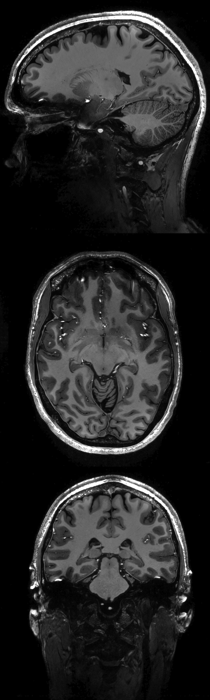
## Prospective and Deep Learning Based Retrospective Motion Correction for Magnetic Resonance Imaging

<div class="left-align">
    M.Sc. Alessandro Sciarra<br>
    Faculty of Natural Sciences, Otto von Guericke University, Magdeburg, Germany<br>
    BMMR Group, MedDigit Group<br>
    Otto von Guericke University, Magdeburg, Germany<br>
</div>
<br>
<div class="right-align">
    <strong>Head of the commission:</strong><br>
    Prof. Dr. Andreas Menzel<br>
    <strong>Reviewers:</strong><br>
    Prof. Dr. Oliver Speck, 
    Prof. Dr. Maxim Zaitsev<br>
    <strong>Members of the Commision:</strong><br>
    PD Dr.-Ing. Philipp Berg, 
    PD Dr.-Ing. Gerald Kasner<br>
</div>

&nbsp;&nbsp;&nbsp; <!-- Add spaces -->

<!-- &nbsp;&nbsp;&nbsp; Add spaces -->

<!-- &nbsp;&nbsp;&nbsp; Add spaces -->


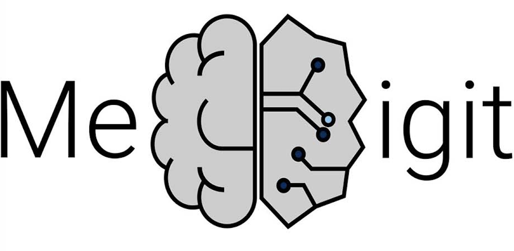

<!-- <div class="image-row">
  
  
  
</div> -->

<!-- Ultra-High Field Magnetic Resonance Imaging: HiMR

Marie Curie Initial Training Network -->
<!-- https://www.nottingham.ac.uk/himr/students/alessandro-sciarra.aspx -->

<!-- ---

#### Outline

- Introduction to MRI
  <!-- + Magnetic Resonance Imaging and MRI@Ultra High Field: a short intro
  + Problem: Motion Artefacts in MRI
  + Solution: Motion Correction in MRI -->
<!-- - Prospective Motion Correction (PMC)  -->
  <!-- + What is PMC and how it works (pros & cons) -->
  <!-- + Goal: Qualitatively And Quantitatively Evaluation of PMC -->
<!-- - Deep Learning Based Retrospective Motion Correction (RMC)
- Structural Imaging with PMC
- Retrospective Motion Artefacts Detection and Correction using Deep Learning 
- Conclusion and Open Questions  -->
<!-- - Goal: why this work?
- Prospective Motion Correction (PMC): State of the art and our setup
- Image Quality Assessment for PMC: Results
- Conclusion
- Deep Learning for Motion Correction: the Retrospective approach
- Evaluation
- conclusion
- Future Work -->

---
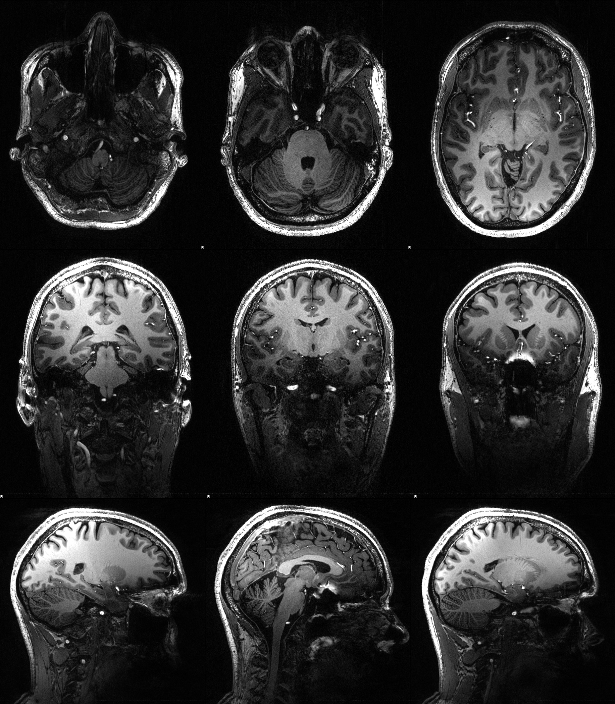
## Magnetic Resonance Imaging 

- A non-invasive imaging technique
- Uses strong magnetic fields and radio waves
- Produces detailed images of organs and tissues

---

## Magnetic Resonance Imaging: 
### How does it work?

1. **Proton spins** initially exhibit random orientations in space. 
2. A **strong magnetic field** induces **alignment** of the proton spins.
3. **Radiofrequency pulses** induce **precession** in a subset of proton spins.
4. Following the pulse, these spins undergo **relaxation** back to their equilibrium orientations, resulting in the **emission** of detectable **signals**.
5. The emitted signals are **acquired** and **processed** to generate a diagnostic image.


<!-- 
```
   +---------------------+    1. Magnetic Fields
   |                     |    MRI Machine: Represents the MRI scanner. 
   |      MRI Machine    |    A superconductive magnet generates a strong static magnetic field.
   |                     |
   +---------------------+
            |
            |  Strong Magnetic Field
            |
            v
   +---------------------+    
   |                     |    Hydrogen Atoms: 
   |   Hydrogen Atoms    |     - The human body is primarily composed of water, which contains hydrogen atoms.
   |   Align with Field  |     - When placed in a strong magnetic field (typically 1.5T to 7T), 
   |                     |       the hydrogen protons align with the direction of the magnetic field.
   +---------------------+
            |
            |  RF Pulses
            |
            v
   +---------------------+     2. Radiofrequency Pulses
   |                     |     Excitation: Once the protons are aligned, the MRI machine sends radiofrequency (RF) pulses into the body. 
   |   Emit Signals      |     These pulses excite the protons, causing them to absorb energy and move to a higher energy state.
   |   as they Relax     |     Relaxation: After the RF pulse is turned off, the protons begin to relax back to their original state, 
   |                     |     releasing energy in the process.
   +---------------------+
            |
            |  Signals Processed
            |                  
            v                  3. Signal Detection
   +---------------------+     Receiving Coils: The released energy is detected by receiving coils in the MRI machine. 
   |                     |     The signals generated depend on the type of tissue and its environment, which allows 
   |   Image Formation   |     for differentiation between various structures in the body.
   |                     |
   +---------------------+     4. Image Reconstruction
                               Fourier Transform: The signals collected are processed using mathematical algorithms, 
                               primarily the Fourier Transform, to convert them into images. T
                               This process reconstructs the spatial information to create detailed cross-sectional images of the body.

``` -->

---

## Image acquisition of a $T_2^*$-weighted 2D gradient image. (a) Pulse sequence diagram; (b) k-space 2D-image and (c) reconstructed 2D-image.
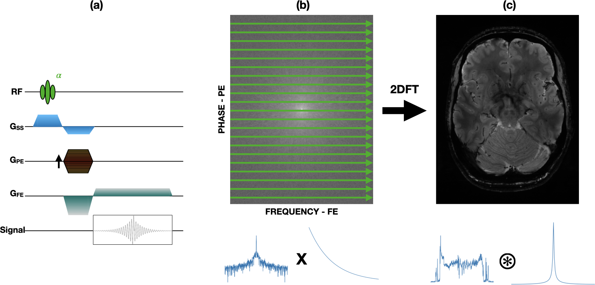

--- 

###  Motion Artefacts in MRI:
- Motion artefacts in MRI are distortions or errors in the images caused by patient movement during the scanning process.
- These artefacts can be caused by:
  + Patient Movement
  + Physiological Motion
  + Long Scan Times

- Types of Motion Artefacts:
  + Ghosting Artefacts
  + Blurring Artefacts
  + Phase Encoding Artefacts
  + Chemical Shift Artifacts:  While not purely motion-related, these artefacts can be exacerbated by patient movement and can manifest as misalignment between fat and water signals.

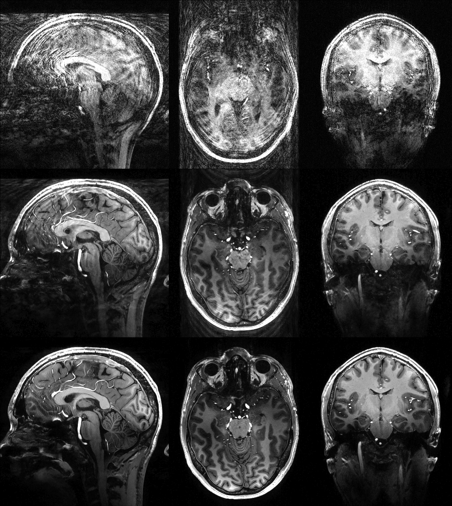

---
### Motion Correction in MRI: State-of-the-Art and AI Advances

#### State-of-the-Art in Motion Correction

| Technique                         | Description                                                                               |
|-----------------------------------|-------------------------------------------------------------------------------------------|
| **Prospective Motion Correction (PMC)** | Real-time adjustments during MRI acquisition.                                            |
| **Retrospective Motion Correction (RMC)** | Post-processing techniques to correct motion artefacts.                                |
| **Data Acquisition Strategies**       | Techniques like PROPELLER, radial/spiral sampling, and fast-imaging methods.              |

#### Recent AI Advances

| AI Technique                      | Description                                                                               |
|-----------------------------------|-------------------------------------------------------------------------------------------|
| **Deep Learning Approaches**          | Neural networks for motion artefact reduction and motion estimation.                      |
| **Self-Supervised Learning**          | Uses motion-guided implicit neural representations for correction.                        |
| **Physics-Informed Models**           | Combines deep learning with physics-based modeling for improved accuracy.                 |
<!-- | **MIT Research**                      | Combines deep learning and physics to correct motion artifacts in MRI scans.              | -->

<!-- ## Future Directions

- Enhancing generalization across different datasets.
- Reducing the need for extensive training data.
- Integrating AI with real-time MRI systems for better patient outcomes. -->


---

## Goal of this thesis: Advanced Motion Correction in MRI

### Overall Objective
- Investigate and address the challenge of motion correction in MRI through the application of Prospective Motion Correction (PMC) and Deep Learning-based Retrospective Motion Correction (RMC) methodologies.


##### Prospective Motion Correction (PMC)
- Develop techniques for motion correction at ultra-high field strength (7 Tesla) MRI.
- Focus on achieving accurate motion correction in a regime of minimal motion.
- Apply methods exclusively to high-resolution structural brain imaging.

##### Deep Learning-Based Retrospective Motion Correction (RMC)
- Evaluate the efficacy of deep learning models in predicting and correcting motion artifacts.
- Use Structural Similarity Index (SSIM) to quantitatively assess image quality improvements.
- Develop and test various custom models designed to address specific types of motion artifacts in brain MRI.

<!-- ### Assessing the impact of the prospective motion correction using 
### an in-bore optical tracking system, in case of high-resolution 
### structural imaging in regime of quasi-no motion. -->
<!-- - Prospective Motion Correction (PMC):
  + Tackle the problem of motion correction at 7T MRI in a regime of quasi-no-motion, 
  focusing solely on high resolution brain imaging.

- Deep Learning Based Retrospective Motion Correction (RMC):
  + Assess image quality through Structural Similarity Index (SSIM) predictions.
  + Implement motion correction using various ad-hoc models tailored to specific motion artifacts. -->
---
### Prospective Motion Correction

<!-- 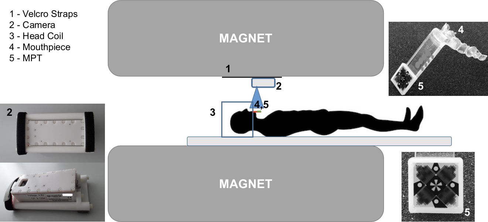 -->
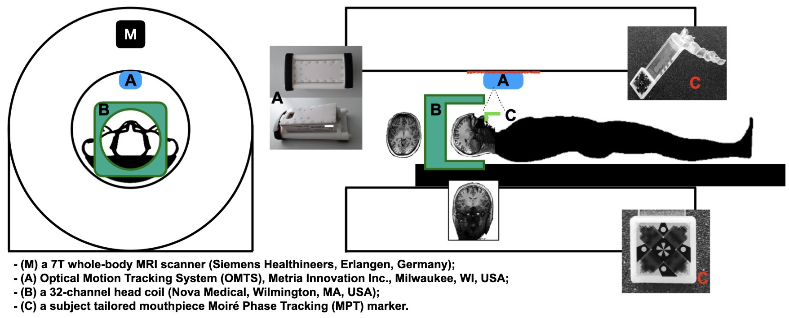

---
#### Prospective Motion Correction: How Does It Work? [1]

- **Real-Time Monitoring**:
  + Uses motion tracking to detect head movements during scans.

- **Dynamic Adjustments**:
  + Adjusts imaging parameters in real-time to correct detected motion.

- **Affine Transformations**:
  + Aligns images with real-time adjustments for consistency.

- **Integration with Sequences**:
  + Can be used with various imaging sequences; effectiveness varies by sequence and motion type.
 
 
**[1]** Maclaren et al. Magn Reson Med. 2013 Mar 1;69(3):621-36. doi: 10.1002/mrm.24314. Epub 2012 May 8. PMID: 22570274.

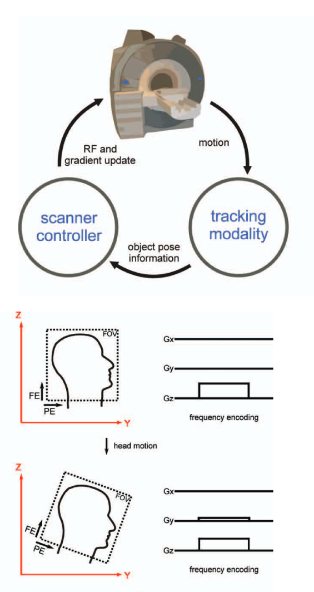

<!-- - **Real-Time Monitoring**: 
  + PMC systems utilize motion tracking devices to monitor head movements during the scan.
  + This allows for immediate detection of any changes in position and orientation.
- **Dynamic Adjustments**:
  + Once motion is detected, the imaging system adjusts the acquisition parameters in real-time.
  + This may involve altering the gradient fields or the timing of radio-frequency pulses to compensate for the detected motion.

- **Affine Transformations**:
  + The adjustments made are often based on affine transformations, which help align the images as they are being acquired.
  + This ensures that the images remain consistent and aligned with the intended anatomical structures.

- **Integration with Imaging Sequences**:
  + PMC can be integrated with various imaging sequences.
  + The effectiveness of PMC can vary depending on the specific sequence used and the nature of the motion. -->

<!-- Prospective motion correction (PMC) is a technique used in functional MRI (fMRI) to minimize motion artifacts during imaging. It involves real-time adjustments to the imaging pulse sequence based on detected head movements. By continuously updating the gradients and radio-frequency pulses in response to motion, PMC helps maintain the anatomical integrity of the images being captured. Here’s a breakdown of how it works:

Key Components of Prospective Motion Correction

Real-Time Monitoring:

PMC systems utilize motion tracking devices (like optical or electromagnetic sensors) to monitor head movements during the scan.
This allows for immediate detection of any shifts in position.
Dynamic Adjustments:

Once motion is detected, the imaging system adjusts the acquisition parameters in real-time.
This may involve altering the gradient fields or the timing of radio-frequency pulses to compensate for the detected motion.
Affine Transformations:

The adjustments made are often based on affine transformations, which help align the images as they are being acquired.
This ensures that the images remain consistent and aligned with the intended anatomical structures.
Integration with Imaging Sequences:

PMC can be integrated with various imaging sequences, including echo-planar imaging (EPI) and multiband EPI.

The effectiveness of PMC can vary depending on the specific sequence used and the nature of the motion.

Challenges and Considerations

Precision and Accuracy:

The success of PMC relies heavily on the precision of motion measurement. If the motion is not accurately detected, the corrections may be inadequate.
Continuous validation of PMC methods is essential to ensure they are effective across different imaging scenarios.
Impact of New Imaging Techniques:

As imaging technology evolves, such as with the introduction of multiplexed EPI, existing PMC techniques may need reevaluation.
New sequences may introduce different motion sensitivities that could affect the performance of PMC.
Holistic Approach:

A comprehensive understanding of the entire fMRI process, from acquisition to analysis, is crucial for optimizing PMC.

Collaboration between pulse sequence developers and image processing algorithm designers can lead to better outcomes.

Future Directions

Improved Algorithms:

Ongoing research is focused on developing more sophisticated algorithms that can better handle motion correction in real-time.
This includes exploring machine learning techniques to enhance motion detection and correction capabilities.
Validation and Testing:

There is a need for rigorous testing of PMC methods across various fMRI applications to establish their reliability and effectiveness.
Researchers should demand a higher burden of proof before adopting new PMC techniques in clinical and research settings.
Prospective motion correction represents a significant advancement in fMRI technology, aiming to enhance the quality of brain imaging by addressing the challenges posed by patient movement -->


--- 
# Experimental Setup:
- a 7T whole-body MRI scanner (Siemens Healthineers, Erlangen, Germany)
- a 32-channel head coil (Nova Medical, Wilmington, MA, USA) 
- Optical Motion Tracking System (OMTS), Metria Innovation Inc., Milwaukee, WI, USA
- 21 healthy volunteers were scanned over the course of two independent 75-minute long sessions 
(14 males, 31.5±6.1 years old, and 7 females, 27.3±3.4 years old).

<!-- ## 21 Subjects, 
### Sequence parameters

| **Sequence**        | MPRAGE         | TSE            | TSE            | GRE            | GRE            | GRE            |
|---------------------|----------------|----------------|----------------|----------------|----------------|----------------|
| **Encoding**        | 3D             | 2D             | 2D             | 2D             | 2D             | 2D             |
| **Contrast**        | $T_1$          | $T_2$          | $PD$           | $T_2^*$        | $T_2^*$        | $T_2^*$        |
| **PMC**             | On/Off         | On/Off         | On/Off         | On/Off         | On/Off         | On/Off         |
| **In-plane res. (mm)** | 0.45 iso | 0.28 iso | 0.28 iso | 0.5 iso | 0.35 iso | 0.25 iso |
| **Slice thick. (mm)** | 0.45          | 1.0            | 1.0            | 1.5            | 1.5            | 1.5            |
| **Matrix size (voxel)** | 496 x 496    | 690 x 704      | 690 x 704      | 336 x 448      | 480 x 640      | 672 x 896      |       
| **Voxel vol. (mm$^3$)** | 0.091        | 0.078          | 0.078          | 0.375          | 0.184          | 0.094          |
| **Slices**          | 416            | 15             | 15             | 30             | 30             | 30             |
| **TR (ms)**         | 2820           | 6000           | 6000           | 680            | 680            | 680            |
| **TE (ms)**         | 2.82           | 59.0           | 9.9            | 16.6           | 15.1           | 16.6           |
| **TI (ms)**         | 1050           | -              | -              | -              | -              | -              |
| **Flip angle (deg)**| 5              | 130            | 130            | 30             | 30             | 30             |
| **Bandwidth (Hz/px)** | 170          | 473            | 473            | 60             | 60             | 60             |
| **Total ADC (ms)**  | 5.88           | 2.11           | 2.11           | 16.67          | 16.67          | 16.67          |
| **TA (min:sec)**    | 12:12          | 5:12           | 5:12           | 8:21           | 11:37          | 15:58          |
| **Parallel imaging** | GRAPPA 2       | GRAPPA 2       | GRAPPA 2       | GRAPPA 2       | GRAPPA 2       | GRAPPA 2       | -->


---

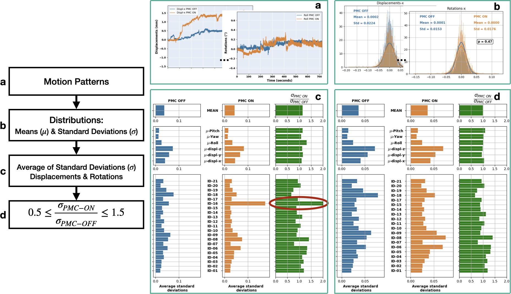

---
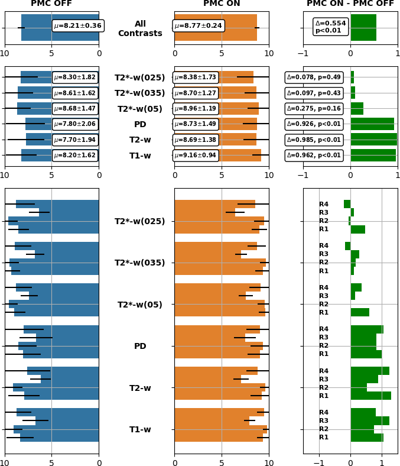
### Subjective Image Quality Assessment

- **Expert Reviewers**:
  + Four experts with over five years of MR image-quality assessment expertise.
  
- **Blinded Comparison**:
  + Raters performed side-by-side comparisons of images with and without PMC.
  + Image presentations were randomized to avoid bias.

- **Scoring System**:
  + Image quality rated from 1 (worst) to 10 (best) based on motion artefacts.
  <!-- + Scores reflect the degree of corruption due to motion. -->

<!-- ### Statistical Analysis
- **Intraclass Correlation Coefficient (ICC)**:
  + Calculated using Pingouin to assess agreement among raters. -->

---
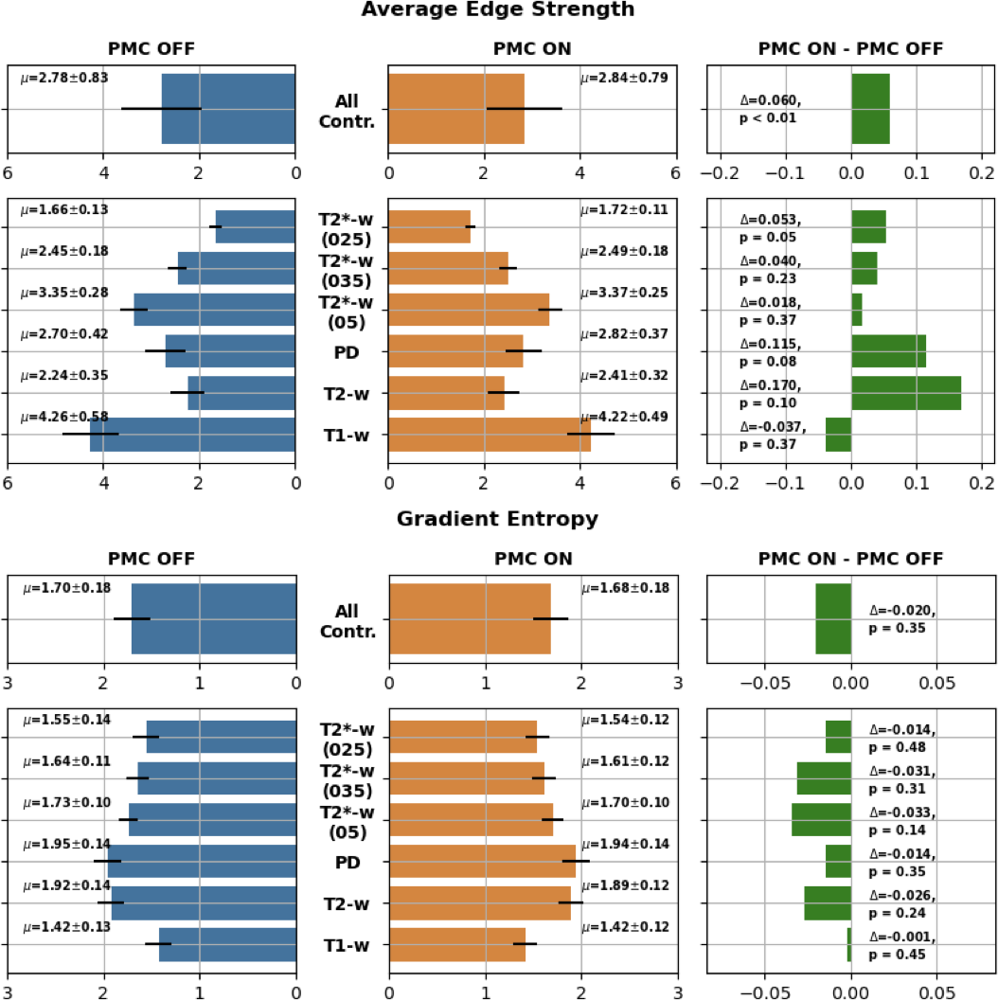
## Objective Image Quality Assessment

### Evaluation Metrics
- **Average Edge Strength (AES)**: Measures the average strength of edges in an image, indicating the clarity and sharpness of structural details.
- **Gradient Entropy (GE)**: Evaluates the randomness and complexity of the gradient distribution, reflecting the overall texture and contrast of the image.

---


## Key Findings

- **High-Resolution MRI**:
  + PMC significantly improves image quality in high-resolution scans.
  + Majority of images with PMC ON showed high or very high quality.
  + Only three scenarios showed statistically significant improvement, but overall subjective and objective measures indicate better quality with PMC.

- **Evaluation Metrics**:
  + Five out of six groups showed higher image quality with PMC.
  + One group showed inconsistent results between subjective and objective metrics.

- **Applicability of PMC**:
  + PMC is beneficial for high-resolution scans even in the absence of deliberate motion.
  + Effective for healthy, compliant participants.

<!-- ### Extra:

- **Intentional Motion**:
  + PMC improves image quality even with high levels of motion.
  + Indicates potential use for non-compliant patients (e.g., Parkinson's disease) when combined with additional motion prevention or RMC techniques. -->
---

## Limitations
- **Statistical Significance**:
  + Limited scenarios showed statistically significant improvement.
  + Some cases exhibited inconsistencies between subjective and objective measures.

- **Motion Pattern Variability**:
  + Comparability of motion patterns for PMC ON and OFF not always consistent.
  + Some groups did not show clear superiority in image quality metrics.

- **Extremes of Motion**:
  + PMC's effectiveness decreases with very high levels of motion.
  + Requires further techniques or integration with RMC for extreme cases or non-compliant patients.

- **Patient Compliance**:
  + Effectiveness is more pronounced in compliant subjects.
  + Additional challenges in applying PMC to non-compliant patients without supplementary measures.

---

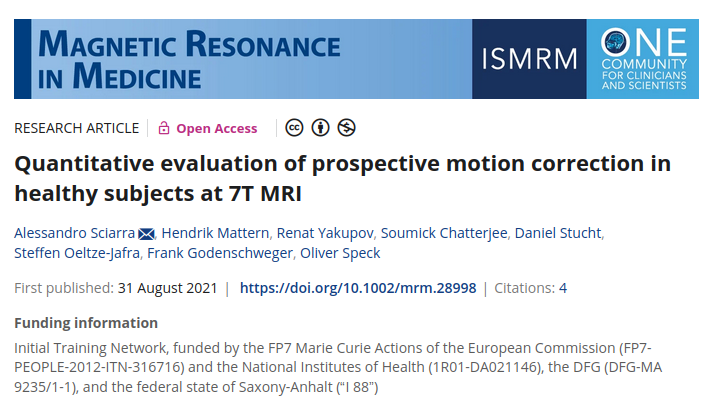

---
# Retrospective Motion Artefacts Detection and Correction Using Deep Learning

---

# A big thank you to:

<div class="two-columns">
  <div class="column">
  <strong>Prof. Oliver Speck</strong>,                               
    Kathrin Schulze,  Frank Godenschweger,                
    Daniel Stucht, Hendrik Mattern, Astrid Wollrab,
    Yi-Hang Tung, Mahsa Fatahi, Peter Schulze, 
    Sebastian Hupfeld, Renat Yakupov, Oleg Posnansky,
    Urte Kägebein, Yan Arnold, Nicolas Huch, Michel Pohl,
    Uten Yarach, Weiqiang Dou, Shan Yang, Myung-Ho In,
    Dominik Kolmann, Tobias Leutritz, Denis Kokorin,
    Tino-Johannes Lüttge, Falk Lüsebrink-Rindsland
    <br>
    <strong>Prof. Steffen Oeltze-Jafra</strong>, Yannic Waerzeggers,
    Max Dünnwald, Juliane Müller
    <br>
    Special thanks to <strong>Soumick Chatterjee</strong> and <strong>Max Dünnwald</strong>
  </div>
  <div class="column">
    <strong>Funding information</strong><br>
    
    
    
    
    <br>
    Initial Training Network, funded by the
    FP7 Marie Curie Actions of the European
    Commission (FP7- PEOPLE- 2012-
    ITN- 316716) and the National Institutes
    of Health (1R01-DA021146), the DFG
    (DFG- MA 9235/1-1), and the federal state
    of Saxony-Anhalt (“I 88”)<br>
    <br>
    <strong></strong>

  </div>
</div>

---

# An extraordinary thank you to:

<div class="two-columns">
  <div class="column">
  <strong>Irene Bartolini (my wife)</strong>,                               
    <br>
  <strong>Agnese & Benedetta (my twin daughters)</strong>,
    <br>
  <strong>and all my family and friends for their invaluable help and support</strong> 
  </div>
  <div class="column">
  </div>
</div>
