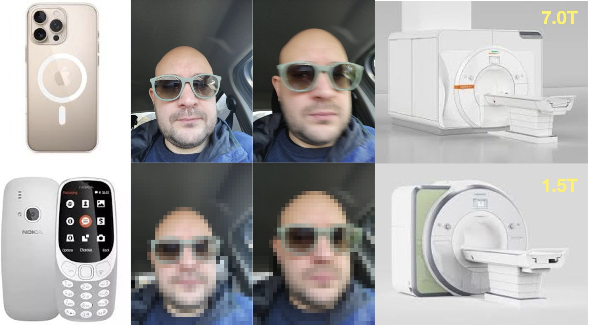
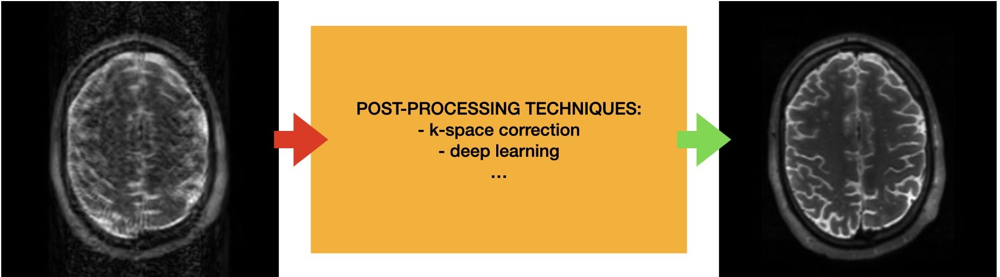
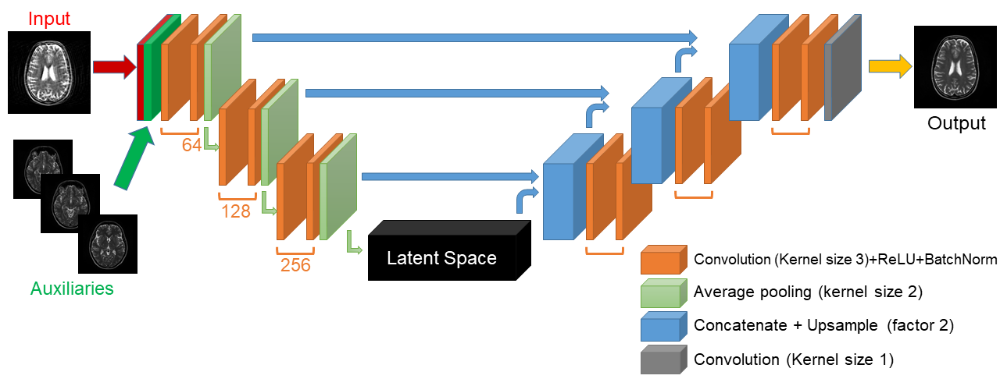
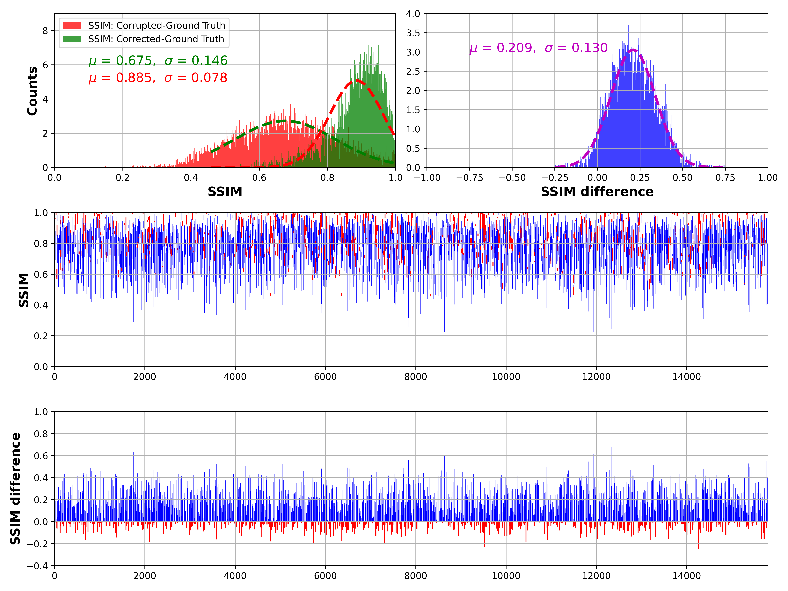

## Prospective and Deep Learning Based Retrospective Motion Correction for Magnetic Resonance Imaging

    M.Sc. Alessandro Sciarra 
    Faculty of Natural Sciences, Otto von Guericke University, Magdeburg, Germany 
    BMMR Group, MedDigit Group 
    Otto von Guericke University, Magdeburg, Germany 

 

    <strong>Head of the commission:</strong> 
    Prof. Dr. Andreas Menzel 
    <strong>Reviewers:</strong> 
    Prof. Dr. Oliver Speck, 
    Prof. Dr. Maxim Zaitsev 
    <strong>Members of the Commision:</strong> 
    PD Dr.-Ing. Philipp Berg, 
    PD Dr.-Ing. Gerald Kasner 

<!-- &nbsp;&nbsp;&nbsp; Add spaces
 

 -->

    
    
    
    
    
    

---

# What's the problem?
##  Motion! 
### The Enemy of Photographers and MRI Users!

- Please ignore the unfortunate subject in the photos! 😄

- Whether you're taking a selfie with your latest top smartphone (top row) or an old Nokia 3310, motion can always degrade image quality, regardless of the resolution you can achieve.
---

## Magnetic Resonance Imaging 

- A non-invasive imaging technique
- Uses strong magnetic fields and radio waves
- Produces detailed images of organs and tissues

---

###  Motion comes in "many forms" ...
- Motion artefacts in MRI are distortions or errors in the images caused by patient movement during the scanning process.
- These artefacts can be caused by:
  + Patient Movement
  + Physiological Motion

- Types of Motion Artefacts:
  + Ghosting Artefacts
  + Blurring Artefacts

---

### Image Formation
1. An MRI image is created using strong magnetic fields and radio waves (**pulse sequence**) to excite hydrogen atoms in the body.
2. The excited hydrogen atoms emit signals that are captured during imaging.
3. These signals are acquired in **k-space**, where each point represents different frequency and phase information.
4. The k-space data is transformed to produce detailed images of internal structures. 

Top image: left magnitude k-space, right reconstructed image.
Bottom image: left magnitude k-space, center phase k-space, right reconstructed image.

---

# K-space and Motion Artefacts
1. Movement of the object during imaging causes inconsistencies in phase and amplitude.  
2. These inconsistencies lead to blurring and ghosting in the images.  
3. The nature of the motion artefact depends on the timing of the motion relative to the acquisition.  

From left: Reconstructed Image, Magnitude (k-space) and Phase (k-space)

---
# Possible solutions (1): Prospective Motion Correction (PMC)
- **Real-Time Monitoring**: Uses motion tracking to detect head movements during scans.

- **Dynamic Adjustments**: Adjusts imaging parameters in real-time to correct detected motion.

- **Affine Transformations**: Aligns images with real-time adjustments for consistency.

- **Integration with Sequences**: Can be used with various imaging sequences; effectiveness varies by sequence and motion type.

**[1]** Maclaren et al. Magn Reson Med. 2013 Mar 1;69(3):621-36. doi: 10.1002/mrm.24314. Epub 2012 May 8. PMID: 22570274.

---
# Possible solutions (2): Retrospective Motion Correction (RMC)

### How RMC Works:
1. **Data Acquisition**: MRI data is collected during patient movement.
2. **Motion Detection**: The system identifies motion artefacts in the data.
3. **Image Reconstruction**: The algorithm adjusts the data to compensate for motion.
4. **Final Image**: Corrected images are reconstructed for clearer anatomical representation.

---

## Goal of this thesis
### Investigate and address the challenge of motion correction in MRI on both ends of the motion correction spectrum:

- **Quantitative evaluation of PMC in structural imaging** for  small involuntary motion in ultra-high resolution imaging

- **Deep Learning-Based Retrospective Motion Correction (RMC)** for gross motion in clinical (1.5-3.0 Tesla) imaging

--- 
## Study: Evaluating PMC in High-Resolution MRI @7T
- **Novelty & Differences**: 
  + NO INTENTIONAL MOTION to mimic a routine research setting, 
  + MULTIPLE WEIGHTINGS & RESOLUTIONS ($T_1$, $T_2$, $PD$, $T_2^*$), **252** scans in total,
  + LARGER COHORT OF SUBJECTS.
<!-- However, these studies focused on a single contrast
and included only small cohorts (1-11 subjects). Thus, a
comprehensive assessment of the performance of PMC for
high- resolution MRI in a larger cohort is missing. To that
end, we acquired data of 21 healthy subjects for four different
sequences at 7 T. To mimic a routine research setting, sub-
jects were asked not to move (unlike most motion- correction
studies that correct for intentional motion). The images were
assessed subjectively through expert ratings and objectively
with image metrics. The aim of this work was to verify and
quantify whether PMC can significantly improve image qual-
ity at 7 T, for healthy compliant subjects and in the regime of
“quasi-no- motion” as introduced by Stucht et al.1 This study
is not meant to assess the performance of PMC for a broader
population of subjects inexperienced with MRI -->
<!-- - 21 healthy volunteers were scanned over the course of two independent 75-minute long sessions 
(14 males, 31.5±6.1 years old, and 7 females, 27.3±3.4 years old).
- $T_1$, $T_2$, $PD$ and $T_2^*$-weighted images for each subject were acquired  -->

---

---

### Subjective Image Quality Assessment

- **Expert Reviewers**:
  + Four experts with over five years of MR image-quality assessment expertise.
  
- **Blinded Comparison**:
  + Raters performed side-by-side comparisons of images with and without PMC.
  + Image presentations were randomized to avoid bias.

- **Scoring System**:
  + Image quality rated from 1 (worst) to 10 (best) based on motion artefacts.
  <!-- + Scores reflect the degree of corruption due to motion. -->

<!-- ### Statistical Analysis
- **Intraclass Correlation Coefficient (ICC)**:
  + Calculated using Pingouin to assess agreement among raters. -->

---

## Objective Image Quality Assessment

### Evaluation Metrics
- **Average Edge Strength (AES)**: Measures the average strength of edges in an image, indicating the clarity and sharpness of structural details.
- **Gradient Entropy (GE)**: Evaluates the randomness and complexity of the gradient distribution, reflecting the overall texture and contrast of the image.

---

- **High-Resolution MRI**:
  + PMC significantly improves image quality in high-resolution scans.
  <!-- + Majority of images with PMC ON showed high or very high quality. -->
  + Only three scenarios showed statistically significant improvement, but overall subjective and objective measures indicate better quality with PMC.

<!-- - **Evaluation Metrics**:
  + Five out of six groups showed higher image quality with PMC.
  + One group showed inconsistent results between subjective and objective metrics. -->

- **Applicability of PMC**:
  + PMC is beneficial for high-resolution scans even in the absence of deliberate motion.
  + Effective for healthy, compliant participants.

---

# Image Quality Assessment (IQA)
- Limits for **Subjective IQA**: Variability Among Observers, Bias, Limited Reproducibility, Time-Consuming, Lack of Objectivity, ... 
<!-- Influence of Context, Inability to Capture All Aspects, Training and Expertise Required. -->
- Current no-reference IQA metrics do not consistently apply to all MR acquisition types, indicating a need for more robust evaluation methods.

**To address this gap, a novel approach has been developed that leverages deep learning for SSIM prediction, providing a more reliable and accurate assessment of image quality.**

---
# Study: SSIM Prediction for Detection and Quantification of Motion Artefacts in Brain MR Images

- Collection of motion artifact-free MR scans (from 1.5 to 7.0T)
- **Data Augmentation** (brightness/contrast adjustment)
- Artificial corruption of MR images
- SSIM calculation between corrupted and motion-free images
- Training ResNet models (ResNet-18 and ResNet-101) to predict SSIM using only corrupted images as input and the calculated SSIM value
- Testing models on both artificially corrupted and clinical data
---

# SSIM Predictions and Model Evaluation

## Results:
- Best model: ResNet-18 trained with data augmentation
- Worst model: ResNet-101 trained without data augmentation
- The analysis of clinical data samples revealed that the highest agreement rate between subjective scores and SSIM predictions was 77.7% for ResNet-101 trained with data augmentation.

### This work is under review:
IEEE Access, "Automated SSIM Regression for Detection and Quantification of Motion Artefacts in Brain MR Images"

---
## What does it happen when the extra hardware required by PMC is not available? 
(Like for example in a clinical setting.)

## Solution: We can use Deep Learning based Retrospective Motion Correction!
<!-- The extra-hardware required by PMC is not available in a clinical setup  -->
<!-- ## BUT WE CAN USE DEEP LEARNING TO TRY TO SOLVE THIS PROBLEM

- The RMC (Retrospective Motion Correction) approach utilizes deep learning to address the challenges of PMC.
  
- Trained and Tested deep learning models that can correct motion artefacts in MRI images retrospectively:
  + **Retrospective Motion Correction of MR Images using Prior-Assisted Deep Learning**
  + **Generalised Retrospective Motion Correction (RMC) using Deep Learning and Contrast Augmentation** -->
<!-- ## Data Preparation -->
<!-- - **Dataset**: 100 participants’ T1, T2, and PD images from IXI Dataset.
- **Artificial Motion Corruption** as done before  -->
  <!-- - Modified TorchIO’s RandomMotion transformation.
  - Simulated movements: rotation from -1.75 to +1.75 degrees (no translation). -->

<!-- ## Image Priors -->
<!-- - **Similar Slices**: 
  - 10 similar slices (same position, same contrast) from different subjects.
  - Used for motion correction of T2-weighted images.
  
<!-- - **Different Contrasts**:  -->
  <!-- - Utilized T1 and PD images from the same subject as priors for motion-corrupted T2 images. --> 
---
<!-- 
 -->

## Study: Retrospective Motion Correction of MR Images using Prior-Assisted Deep Learning

 - **Dataset**: 100 participants’ T1, T2, and PD images from IXI Dataset.
- **Artificial Motion Corruption** as done before
  <!-- - Modified TorchIO’s RandomMotion transformation.
  - Simulated movements: rotation from -1.75 to +1.75 degrees (no translation). -->

- Image Priors (**Similar Slices**): 
  - 10 similar slices (same position, same contrast) from different subjects.
  - Used for motion correction of T2-weighted images.
- **Different Contrasts**:
  - Utilized T1 and PD images from the same subject as priors for motion-corrupted T2 images.
## Network Architectures
- **Baselines**: Modified ReconResNet and U-Net.
- **Prior Supply Techniques**:
  - **Multi-Channel Network**: Concatenated motion-corrupted image with priors.
  - **Dual-Branch Network**: Main branch for corrupted image, auxiliary branch for priors.

---

## Results and Discussions
- **Effectiveness**: 
  - Similar slices did not improve motion correction.
  - Different contrasts significantly enhanced motion correction.
  
- **Performance**: 
  - Multi-channel and dual-branch approaches outperformed ReconResNet.
  - Only multi-channel strategy significantly improved U-Net.

---
## Conclusion
- **Key Findings**: 
  - Additional contrast images from the same subject are more beneficial than similar slices from different subjects.
  - Multi-channel and dual-branch approaches showed improvements, especially for ReconResNet.

- **Future Work**: 
  - Explore dual-branch approach and impact of skip connections.
  - Expand dataset and introduce different motion corruption types for robustness.

### 34th Conference on Neural Information Processing Systems (NeurIPS 2020), Vancouver, Canada

---

<!-- Chatterjee, Soumick, et al. "Reconresnet: Regularised residual learning for mr image reconstruction of undersampled cartesian and radial data." Computers in biology and medicine 143 (2022): 105321. -->
## Study: Generalised Retrospective Motion Correction (RMC) using Deep Learning and Contrast Augmentation

- Previous methods required image priors, limiting generalisability.
- This extension introduces a deep learning method for RMC in MRI using:
  - ReconResNet model.
  - Novel contrast augmentation and artificial motion corruption techniques.

<!-- ---
## Methods

### Data
- Collected from 3T and 7T MRI Siemens scanners.
- **Dataset**: 600 training, 160 validation, and 158 testing image volumes.
- Only slices containing brain tissues were considered.

### Data Processing
- Random slice selection from 3D volumes.
- Noise removal and Min-Max normalization.
- Padding and resizing to 256x256.
- Contrast augmentation (as for the SSIM prediction). -->

---

<!-- ### Motion Corruption (as for the SSIM prediction)
- Two artificial motion corruption techniques:
  1. **TorchIO Functions**: Random ghosting and motion.
  2. **In-House Method**: Simulates real-world motion corruption using random parameters. -->

### Model and Training
- Deeper version of ReconResNet with:
  - 64 feature maps, 56 residual blocks, and PReLU activation.
  - Perceptual loss function using a pretrained ResNeXt 101 model.
- Optimized using Adam with a learning rate of 3x10⁻⁴ for 2000 epochs.

<!-- ---
 -->

---

## Results and Discussion
- Average SSIM improvement from 0.688 to 0.886.
- Consistent performance across different experimental runs.
- Qualitative results show significant enhancement in image quality.

## Conclusion
- Proposed method demonstrates broad generalisation across various MRI contrasts and artefacts.
- Notable improvements in image quality and robustness.
- Future work may explore combining prospective and retrospective motion correction techniques.

---

# A big thank you to:

  

  <strong>Prof. Oliver Speck</strong>,                               
    Kathrin Schulze,  Frank Godenschweger,                
    Daniel Stucht, Hendrik Mattern, Astrid Wollrab,
    Yi-Hang Tung, Mahsa Fatahi, Peter Schulze, 
    Sebastian Hupfeld, Renat Yakupov, Oleg Posnansky,
    Urte Kägebein, Yan Arnold, Nicolas Huch, Michel Pohl,
    Uten Yarach, Weiqiang Dou, Shan Yang, Myung-Ho In,
    Dominik Kolmann, Tobias Leutritz, Denis Kokorin,
    Tino-Johannes Lüttge, Falk Lüsebrink-Rindsland
     
    <strong>Prof. Steffen Oeltze-Jafra</strong>, Yannic Waerzeggers,
    Max Dünnwald, Juliane Müller
     
    Special thanks to <strong>Soumick Chatterjee</strong> and <strong>Max Dünnwald</strong>
  

  

    <strong>Funding information</strong> 
    
    
    
    
     
    Initial Training Network, funded by the
    FP7 Marie Curie Actions of the European
    Commission (FP7- PEOPLE- 2012-
    ITN- 316716) and the National Institutes
    of Health (1R01-DA021146), the DFG
    (DFG- MA 9235/1-1), and the federal state
    of Saxony-Anhalt (“I 88”) 
     
    <strong></strong>

  

---

# An extraordinary thank you to:

  

  <strong>Irene Bartolini (my wife)</strong>,                               
     
  <strong>Agnese & Benedetta (my twin daughters)</strong>,
     
  <strong>and all my family and friends for their invaluable help and support</strong> 
  

  

  

